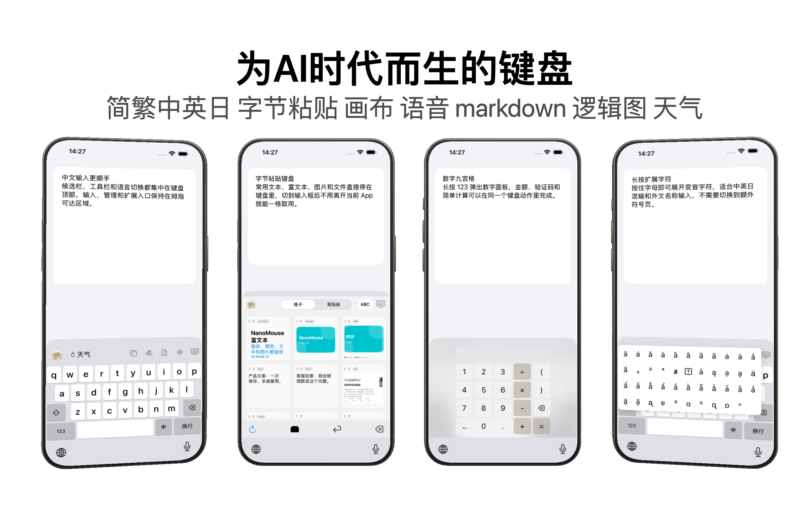
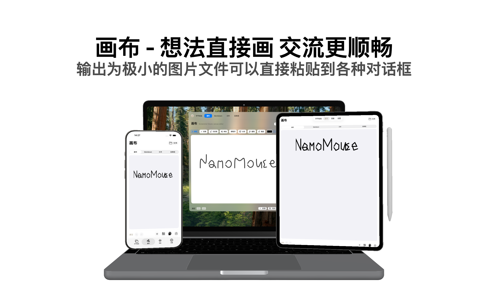
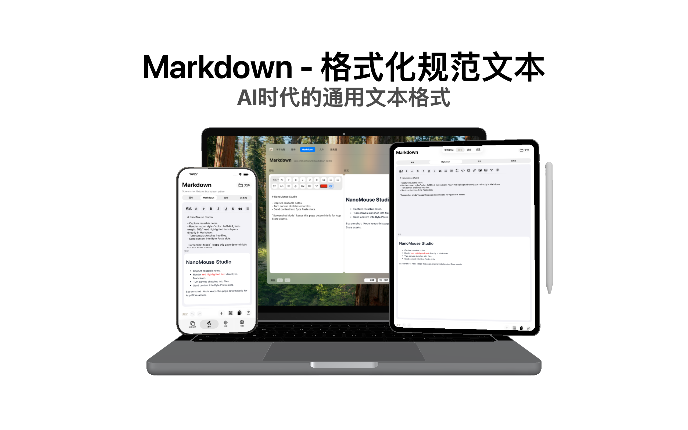
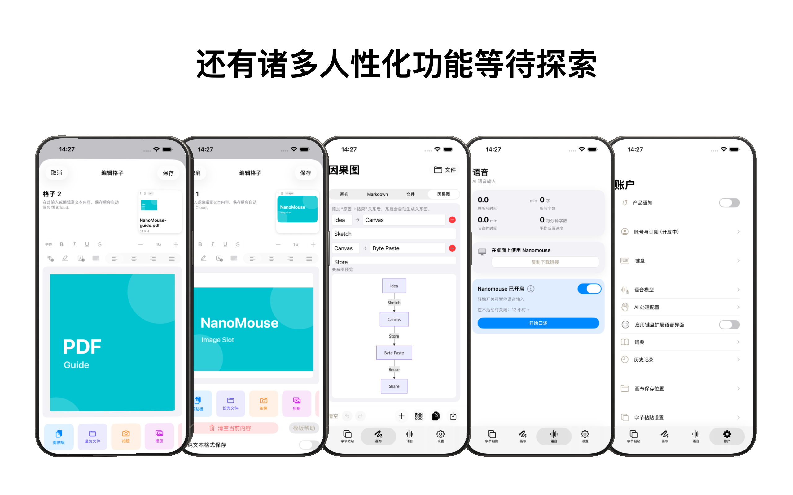

# 鼠输入法（NanoMouse）

[](https://opensource.org/licenses/MIT)
[](#平台支持)

🐭 **输入法、剪贴板、手写画布和输入日记整合在一起的跨平台输入工具**

[English](./README_EN.md) | [官方网站](https://nanomouse.2nori.com/) | [App Store](https://apps.apple.com/app/id6757662900) | [隐私政策](./PRIVACY.md) |
[Privacy Policy](./PRIVACY_EN.md)

---

## 🎯 为什么选择鼠输入法？

**打字时总觉得某些拼音很难按？** 鼠输入法用最小的改动解决最大的痛点：

| 痛点                           | 鼠输入法方案   | 效果                     |
| ------------------------------ | -------------- | ------------------------ |
| `ang/eng/ing` 后鼻音要按两个键 | `nn` 替代 `ng` | `nenn` → 能，少按一键    |
| `uan/uang` 手指跨度大          | `vn/vnn` 替代  | `gvn` → 关，手指不用乱跑 |

**就这么简单。** 不改变你的输入习惯，只是让高频操作更顺手。

同时，鼠输入法已经不只是输入法配置。iOS 主 App、键盘扩展和 macOS 工具围绕“输入内容”做了完整整合：常用片段、富文本、文件、Markdown、手写画布、因果图和输入日记都可以被保存、预览、同步和再次使用。

---

## 🖥️ 平台支持

### iOS — 完整的第三方键盘 App

基于 [仓输入法](https://github.com/imfuxiao/Hamster)
深度定制，这不只是一个配置，而是**一款完整的 iOS 输入法应用**。

**核心功能：**

| 功能                     | 说明                                                        |
| ------------------------ | ----------------------------------------------------------- |
| 📱 **原生键盘体验**      | 按键气泡、触感反馈，和系统键盘一样顺滑                      |
| 🔤 **长按扩展菜单**      | 长按任意键弹出扩展字符，滑动选择 (含拉丁字符全集)           |
| 🔢 **长按数字键盘**      | 长按 `123` 打开完整数字键盘，内置计算器                      |
| 🌐 **中/日/英 快速切换** | 长按中/英切换键，弹出菜单一键切换语言                       |
| 🔁 **繁简快速切换**      | 在中文键盘顶部区域长按切换繁体/简体输出                     |
| 🖐️ **单手扇形键盘**     | 中文 26 键支持左手/右手扇形单手模式                         |
| 🔣 **复杂符号键盘**      | 长按符号键 (`#+=`) 进入分类符号界面                         |
| 📝 **系统文本替换**      | 自动读取 iOS「设置 > 通用 > 键盘 > 文本替换」               |
| 🎌 **多方案支持**        | 雾凇拼音、小鹤双拼、自然码双拼、日语罗马字、笔画输入等      |
| 🧩 **字节粘贴**          | 在键盘中调用常用文本、富文本、图片、PDF、文件和网页链接预览 |
| ☁️ **iCloud 同步**       | 主 App、键盘扩展和 macOS 之间同步字节粘贴内容               |

**输入体验增强：**

- 🎯 **误触纠错**：常见误触自动修正（如 `xo→co`、`aong→song` 等）
- 🔀 **多语言快速混输**：中/日/英同一候选栏连续输入，不打断思路
- 🇬🇧 **英语候选栏**：英文输入也有候选与拼写纠错
- 🔢 **数字混输**：拼音/日语输入中数字自然融合
- 🧠 **AzooKey + Zenzai AI（可选）**：日语输入可开启 AI 增强（需下载模型，低性能设备可关闭）
- 📓 **日记模式**：长按天气区域开启本地记录模式，将输入内容按日期整理为日记
- 🧰 **文件与创作工具**：画布、Markdown、因果图和通用文件区域可保存到 App 的 iCloud Drive 目录

**容易错过的手势和彩蛋：**

- **长按 `123`**：打开完整数字键盘和计算器，不只是切换符号页。
- **长按符号键 `#+=`**：进入分类符号界面，适合找复杂标点、括号和特殊符号。
- **长按中文键盘顶部天气旁区域**：切换简体/繁体输出。
- **在中文键盘顶部区域左滑 / 右滑**：进入左手或右手单手扇形键盘。
- **单手扇形键盘空白区域按钮**：可返回双手键盘，或切换到另一只手。
- **长按天气区域**：开启或关闭本地日记记录模式，开启后天气区域会慢速闪烁提示。
- **长按字节粘贴格子**：在键盘里直接展开更多操作，例如复制、粘贴、下载或处理文件内容。
- **长按普通字母键**：显示扩展字符气泡，滑动即可选择。
- **长按或双击 Shift**：锁定大写输入。

**主 App 工作区：**

- **字节粘贴**：每个格子可保存纯文本、富文本、图片、PDF、视频、网页链接和通用文件，支持预览、导出、格纳和跨端同步。
- **画布 / Markdown / 因果图**：可以在同一工作区创建、编辑、保存文件，并将结果放入字节粘贴格子继续复用。
- **文件系统**：使用 App 的 iCloud Drive 容器，文件可在 iOS、iPadOS、macOS 和系统“文件”App 中访问。
- **账户与键盘设置**：管理完全访问、通知、输入方案、键盘布局、日记、天气、缓存和云端文件。

**App Store 截图预览：**

<p align="center">
  
  
  
  
  
  
</p>

**核心输入方案：**

- **雾凇拼音 (rime-ice)**
  - 包含：全拼、双拼（小鹤/自然码/微软/搜狗/紫光/拼音加加等）
- **日语罗马字 Easy (jaroomaji-easy)**
  - 专为手机优化，移除冗余规则，打字更顺手

**其他内置方案：**

- 地球拼音 (terra-pinyin)
- 日语罗马字 (jaroomaji)
- 日语输入 (rime-japanese)
- 笔画输入 (stroke)
- 越南语/韩语 (可添加，如有需要请联系)

源代码：`ios/` 目录 | [编译说明](./ios/README.md)

---

### macOS — 鼠须管 + SCT 图形配置

**一键安装：** 下载
[Nanomouse-Installer.dmg](https://github.com/xjwhnxjwhn/nanomouse/releases/latest)，双击运行即可。

**NanoMouse macOS 工具** — 告别手动编辑 YAML，也能和 iOS 字节粘贴协作：

- 🎨 原生 SwiftUI 界面，完美融入 macOS
- 🔒 非侵入式配置，所有改动写入 `.custom.yaml`，升级鼠须管无忧
- ↩️ 多级撤销/重做 + 自动备份，放心折腾
- ⚡ 高级模式：直接搜索和修改任意 Rime 配置项
- 🔄 集成 Sparkle 自动更新
- 🧩 字节粘贴窗口：管理文本、富文本、图片、PDF、文件和网页链接格子
- ✍️ 画布 / Markdown / 因果图：和 iOS 使用同一套 iCloud Drive 文件区域
- 👀 Quick Look：文件格子支持空格预览，Markdown 和 `.pkdrawing` 使用应用内渲染

> 💡 未安装鼠须管？安装器会引导你一键 Homebrew 安装
>
> ✅ 已有自定义配置？安装器自动备份并智能合并，绝不覆盖

---

### Windows — 小狼毫

1. 安装 [小狼毫 (Weasel)](https://rime.im/download/)
2. 下载 `configs/` 目录下的配置文件，复制到 `%APPDATA%\Rime`
3. 右键任务栏图标 → 重新部署

---

## ⌨️ 键位映射速查

### 后鼻音简化 (ng → nn)

| 输入   | 原拼音 | 示例字     |
| ------ | ------ | ---------- |
| `dann` | dang   | 当、档、党 |
| `henn` | heng   | 恒、横、衡 |
| `dinn` | ding   | 定、顶、钉 |
| `tonn` | tong   | 同、通、痛 |
| `nenn` | neng   | 能、耐能   |

### 键位优化 (uan/uang → vn/vnn)

| 输入    | 原拼音 | 示例字     |
| ------- | ------ | ---------- |
| `gvn`   | guan   | 关、官、管 |
| `hvn`   | huan   | 换、欢、还 |
| `gvnn`  | guang  | 光、广、逛 |
| `chvnn` | chuang | 床、窗、创 |

> **原理**：`v` 在拼音中本就用于 `ü`，而 `guan/guang` 等拼音中不存在 `gv`
> 组合，因此 `vn/vnn` 是无冲突的简写。

---

## 🔧 手动安装（进阶用户）

将配置文件复制到 Rime 用户目录后重新部署：

| 输入方案   | 配置文件                          |
| ---------- | --------------------------------- |
| 明月拼音   | `luna_pinyin_simp.custom.yaml`    |
| 雾凇拼音   | `rime_ice.custom.yaml`            |
| 自然码双拼 | `double_pinyin.custom.yaml`       |
| 小鹤双拼   | `double_pinyin_flypy.custom.yaml` |

**Rime 用户目录：**

- macOS: `~/Library/Rime/`
- Windows: `%APPDATA%\Rime`

配置示例：

```yaml
# luna_pinyin_simp.custom.yaml
patch:
  "speller/algebra/+":
    - derive/ng$/nn/ # ng → nn
    - derive/uan$/vn/ # uan → vn
    - derive/uang$/vnn/ # uang → vnn
```

---

## 📁 项目结构

```
nanomouse/
├── configs/          # 桌面端 Rime 配置文件
├── shared/           # 跨平台共享配置
├── ios/              # iOS 输入法 App（完整 Xcode 项目）
├── mac/
│   ├── gui/          # SCT 配置工具（SwiftUI App）
├── windows/          # Windows 相关
├── installers/       # macOS 安装器
└── build/            # 构建产物
```

---

## 🔄 卸载 / 恢复

恢复原配置：

1. 打开 `~/Library/Rime/`
2. 找到 `nanomouse_backup_*` 文件夹
3. 将文件复制回 `~/Library/Rime/`
4. 重新部署

---

## 🤝 贡献

欢迎提交 Issue 和 Pull Request！

---

## 📄 许可证

[MIT License](./LICENSE)

---

## 🙏 致谢

- [RIME 输入法引擎](https://rime.im/) — 强大的跨平台输入法框架
- [鼠须管 (Squirrel)](https://github.com/rime/squirrel) — macOS 版 Rime
- [小狼毫 (Weasel)](https://github.com/rime/weasel) — Windows 版 Rime
- [仓输入法 (Hamster)](https://github.com/imfuxiao/Hamster) — iOS Rime 实现
- [KeyboardKit](https://github.com/KeyboardKit/KeyboardKit) — iOS 键盘开发框架
- [雾凇拼音](https://github.com/iDvel/rime-ice) — 长期维护的拼音词库

---

**为什么叫 Nanomouse？**

- **nano** = 纳米级小巧，配置只有几行
- **mouse** = 融入 Rime 生态的小动物命名传统（鼠须管、仓鼠…）
