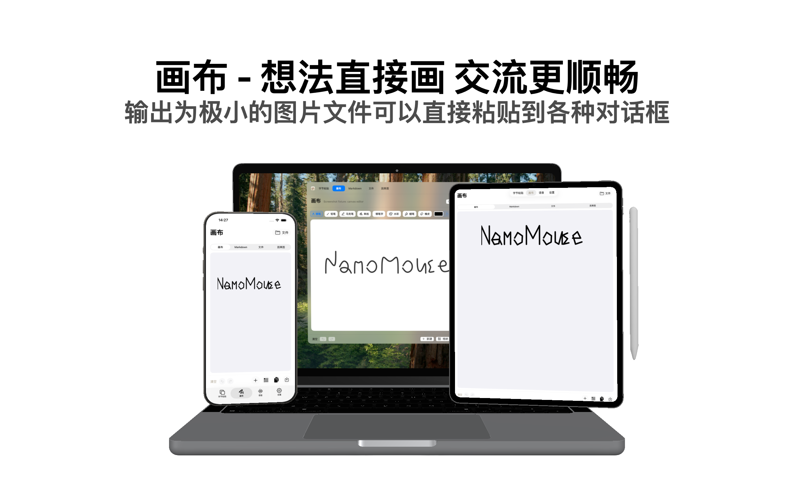
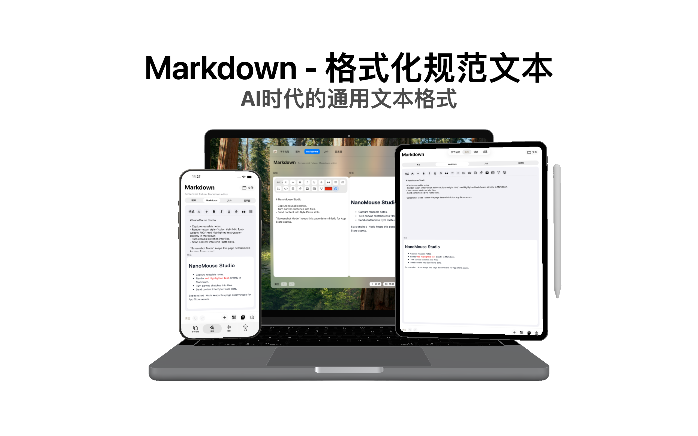
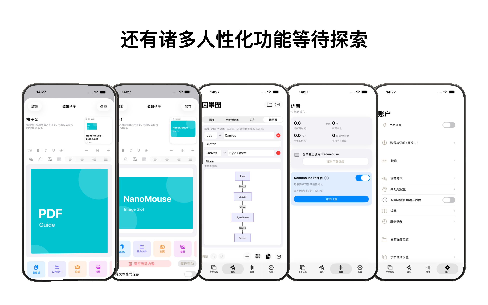

# NanoMouse (鼠输入法)

[](https://opensource.org/licenses/MIT)
[](#platform-support)

🐭 **A cross-platform input workspace that combines keyboard input, snippets, canvas, Markdown, and local input diary**

[中文说明](./README.md) | [Website](https://nanomouse.2nori.com/) | [App Store](https://apps.apple.com/app/id6757662900) | [隐私政策](./PRIVACY.md) |
[Privacy Policy](./PRIVACY_EN.md)

---

## 🎯 Why NanoMouse?

**Tired of awkward key combinations when typing Pinyin?** NanoMouse solves the
biggest pain points with minimal changes:

| Pain Point                             | NanoMouse Solution     | Result                          |
| -------------------------------------- | ---------------------- | ------------------------------- |
| `ang/eng/ing` nasal finals need 2 keys | `nn` replaces `ng`     | `nenn` → 能, one less keystroke |
| `uan/uang` requires finger stretching  | `vn/vnn` replaces them | `gvn` → 关, fingers stay home   |

**That's it.** No learning curve, just smoother typing for high-frequency
patterns.

NanoMouse is now more than a Rime configuration. The iOS app, keyboard
extension, and macOS tool work together around the things you type: snippets,
rich text, files, Markdown, drawings, causal diagrams, and local diary entries
can be saved, previewed, synced, and reused.

---

## 🖥️ Platform Support

### iOS — A Full-Featured Keyboard App

Built on [Hamster](https://github.com/imfuxiao/Hamster), this isn't just a
config — it's **a complete iOS keyboard app**.

**Key Features:**

| Feature                          | Description                                                                |
| -------------------------------- | -------------------------------------------------------------------------- |
| 📱 **Native Keyboard Feel**      | Key bubbles, haptic feedback, smooth like the system keyboard              |
| 🔤 **Long-Press Accent Menu**    | Hold any key for extended characters, slide to select (full Latin)         |
| 🔢 **Long-Press Numeric Keypad** | Hold `123` for a full numeric keyboard with a built-in calculator          |
| 🌐 **CN/JP/EN Quick Switch**     | Long-press CN/EN key for instant language switching                        |
| 🔁 **Trad/Simp Quick Switch**    | Long-press the Chinese toolbar area to toggle Traditional/Simplified output |
| 🖐️ **One-Hand Arc Keyboard**    | Chinese 26-key layout supports left/right arc-style one-hand mode          |
| 🔣 **Complex Symbol Keyboard**   | Long-press symbol key (`#+=`) for categorized symbol view                  |
| 📝 **System Text Replacement**   | Auto-syncs with iOS Settings > General > Keyboard > Text Replacement       |
| 🎌 **Multiple Schemas**          | Rime Ice, Flypy, Ziranma, Japanese Romaji, Stroke input, and more          |
| 🧩 **Byte Paste**                | Reuse text, rich text, images, PDFs, files, and link previews in keyboard  |
| ☁️ **iCloud Sync**               | Sync Byte Paste content between iOS, keyboard extension, and macOS         |

**Typing Enhancements:**

- 🎯 **Mistouch Correction**: Common slips are auto-corrected (e.g. `xo→co`, `aong→song`)
- 🔀 **Multi‑language Quick Mix**: Keep CN/JP/EN in one candidate bar without losing context
- 🇬🇧 **English Candidate Bar**: Suggestions + spell correction for English input
- 🔢 **Number Mixing**: Seamlessly mix numbers while typing Pinyin/Japanese
- 🧠 **AzooKey + Zenzai AI (Optional)**: AI‑enhanced Japanese input (model download required; can be disabled on low-end devices)
- 📓 **Diary Mode**: Long-press the weather area to record typed text locally by date
- 🧰 **Workspace Tools**: Canvas, Markdown, causal diagrams, and a shared files area can be stored in the app's iCloud Drive container

**Main App Workspace:**

- **Byte Paste**: Grid cells can store plain text, rich text, images, PDFs, videos, links, and generic files with previews, export, insertion, and cross-device sync.
- **Canvas / Markdown / Causal Diagram**: Create, edit, save, and insert workspace files into Byte Paste cells.
- **File System**: Uses the app's iCloud Drive container, so files are accessible from iOS, iPadOS, macOS, and Apple's Files app.
- **Account & Keyboard Settings**: Manage full access, notifications, schemas, keyboard layouts, diary, weather, cache, and cloud files.

**App Store Screenshots:**

<p align="center">
  
  
  
  
  
  
</p>

**Core Input Schemas:**

- **Rime Ice (rime-ice)**
  - Includes: Full Pinyin, Double Pinyin
    (Flypy/Ziranma/MSPY/Sogou/Ziguang/Jiajia etc.)
- **Japanese Romaji Easy (jaroomaji-easy)**
  - Optimized for mobile, removes redundant rules for smoother typing

**Other Built-in Schemas:**

- Terra Pinyin (terra-pinyin)
- Japanese Romaji (jaroomaji)
- Japanese Input (rime-japanese)
- Stroke Input (stroke)
- Vietnamese/Korean (Available upon request)

Source code: `ios/` directory | [Build instructions](./ios/README.md)

---

### macOS — Squirrel + SCT GUI Configuration

**One-click install:** Download
[Nanomouse-Installer.dmg](https://github.com/xjwhnxjwhn/nanomouse/releases/latest)
and run.

**NanoMouse macOS Tool** — Manage Squirrel configuration and work with iOS Byte Paste:

- 🎨 Native SwiftUI interface, feels right at home on macOS
- 🔒 Non-invasive config: all changes go to `.custom.yaml`, safe across Squirrel
  upgrades
- ↩️ Multi-level Undo/Redo + auto-backup, experiment freely
- ⚡ Advanced mode: search and modify any Rime config option directly
- 🔄 Built-in Sparkle auto-updates
- 🧩 Byte Paste window: manage text, rich text, image, PDF, file, and link cells
- ✍️ Canvas / Markdown / Causal Diagram: share the same iCloud Drive workspace with iOS
- 👀 Quick Look: file cells can be previewed with Space; Markdown and `.pkdrawing` use app rendering

> 💡 Squirrel not installed? The installer guides you through one-click Homebrew
> installation
>
> ✅ Have existing customizations? Auto-backup and smart merge, never overwrites

---

## ⌨️ Key Mapping Quick Reference

### Nasal Sound Simplification (ng → nn)

| Input  | Original | Example   |
| ------ | -------- | --------- |
| `dann` | dang     | 当 (dāng) |
| `henn` | heng     | 恒 (héng) |
| `dinn` | ding     | 定 (dìng) |
| `tonn` | tong     | 同 (tóng) |
| `nenn` | neng     | 能 (néng) |

### Key Position Optimization (uan/uang → vn/vnn)

| Input   | Original | Example     |
| ------- | -------- | ----------- |
| `gvn`   | guan     | 关 (guān)   |
| `hvn`   | huan     | 换 (huàn)   |
| `gvnn`  | guang    | 光 (guāng)  |
| `chvnn` | chuang   | 床 (chuáng) |

> **How it works:** `v` is already used for `ü` in Pinyin, and combinations like
> `gv` don't exist in `guan/guang`, making `vn/vnn` conflict-free shortcuts.

---

## 🔧 Manual Installation (Advanced)

Copy config files to your Rime user directory and deploy:

| Input Schema            | Config File                       |
| ----------------------- | --------------------------------- |
| Luna Pinyin             | `luna_pinyin_simp.custom.yaml`    |
| Rime Ice                | `rime_ice.custom.yaml`            |
| Double Pinyin (Ziranma) | `double_pinyin.custom.yaml`       |
| Double Pinyin (Flypy)   | `double_pinyin_flypy.custom.yaml` |

**Rime user directory:**

- macOS: `~/Library/Rime/`
- Windows: `%APPDATA%\Rime`

Config example:

```yaml
# luna_pinyin_simp.custom.yaml
patch:
  "speller/algebra/+":
    - derive/ng$/nn/ # ng → nn
    - derive/uan$/vn/ # uan → vn
    - derive/uang$/vnn/ # uang → vnn
```

---

## 📁 Project Structure

```
nanomouse/
├── configs/          # Desktop Rime config files
├── shared/           # Cross-platform shared configs
├── ios/              # iOS Keyboard App (full Xcode project)
├── mac/
│   ├── gui/          # SCT Config Tool (SwiftUI App)
├── windows/          # Windows related
├── installers/       # macOS installer
└── build/            # Build artifacts
```

---

## 🔄 Uninstall / Restore

To restore original config:

1. Open `~/Library/Rime/`
2. Find `nanomouse_backup_*` folder
3. Copy files back to `~/Library/Rime/`
4. Deploy again

---

## 🤝 Contributing

Issues and Pull Requests welcome!

---

## 📄 License

[MIT License](./LICENSE)

---

## 🙏 Acknowledgments

- [RIME Input Method Engine](https://rime.im/) — Powerful cross-platform input
  framework
- [Squirrel](https://github.com/rime/squirrel) — macOS Rime frontend
- [Weasel](https://github.com/rime/weasel) — Windows Rime frontend
- [Hamster](https://github.com/imfuxiao/Hamster) — iOS Rime implementation
- [KeyboardKit](https://github.com/KeyboardKit/KeyboardKit) — iOS keyboard
  framework
- [Rime Ice](https://github.com/iDvel/rime-ice) — Well-maintained Pinyin
  dictionary

---

**Why "Nanomouse"?**

- **nano** = Tiny — just a few lines of config
- **mouse** = Following Rime's small animal naming tradition (Squirrel,
  Hamster...)
