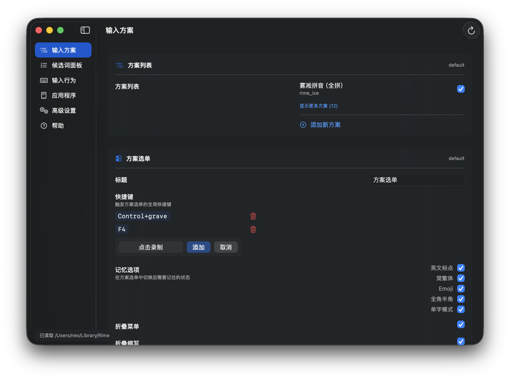

# Squirrel Configuration Tool (SCT)

*更多截图参见 [Screens](Screens) 目录下*

SCT 是专为 macOS 上的 [鼠须管 (Squirrel)](https://github.com/rime/squirrel) 输入法设计的原生 GUI 配置工具，旨在为用户提供一种简洁、安全且高效的方式来管理和定制 Rime 输入法的各种设置，（大多数情况下）无需直接编辑复杂的 YAML 配置文件。

- **原生 macOS 体验**：采用 SwiftUI 构建，完美契合 macOS 系统设计风格；大大简化快捷键、应用特定设置等复杂配置过程。
- **非侵入式配置**：严格遵循 Rime 的 `patch` 逻辑，所有修改均写入 `.custom.yaml` 文件，绝不触动系统默认配置，确保升级无忧。
- **高级模式**：对于进阶用户提供高级编辑模式，用户可以搜索和修改任何默认配置项的值，也支持手工修改配置文件。
- **多级撤销和自动备份**：内置多级撤销/重做（Undo/Redo）和自动备份机制，可以更安心地进行配置修改。
- **自动更新**：集成 Sparkle 2 引擎，一键检查并升级到最新版本。

在技术实现层面，SCT 为长期持续维护更新做了精心设计：
- **双层配置模型**：智能合并 Base 层（只读）与 Patch 层（读写），提供最终生效配置的统一视图。
- **Schema 驱动 UI**：通过 `ConfigSchema.json` 动态生成界面，无需修改代码即可支持 Rime 未来的新配置特性。
- **现代化分发流水线**：基于 GitHub Actions 和 Sparkle 2 的自动构建、签名、公证及分发流程。
- **AI Agent 友好的开发流程**：支持 AGENTS.md 协作接口，便于不同 AI 助手参与开发和维护。

## 下载与安装

前往 [Releases](https://github.com/neolee/sct/releases) 页面下载最新的 `SCT.dmg`。首次运行时，程序会请求访问 `~/Library/Rime` 目录的权限，请按程序提示操作。

## 常见问题 FAQ

1. 为什么我的更改没有生效？

   在 SCT 中修改配置后，您需要点击工具栏上的“部署”按钮（或使用快捷键 `Cmd+R`），这会触发 Squirrel 重新加载配置。

2. 如何添加新的输入方案？

   在“输入方案”页面，点击底部的“添加新方案”按钮，输入方案 ID（如 `rime_ice`）和名称，SCT 会自动为您创建基础的方案文件并将其添加到激活列表中。

3. 如何撤销 *Undo* 更改？

   SCT 支持多级撤销和重做，您可以使用快捷键 `Cmd+Z` 撤销上一步更改，使用 `Cmd+Shift+Z` 重做被撤销的更改。

4. 什么是“高级设置”？

   “高级设置”允许您浏览 Rime 的完整配置树，您可以直接修改其中的任何值，SCT 会自动将其添加到对应的 `.custom.yaml` 文件中。注意：这是一个只面向高级用户的功能，如果你不确定你是不是该使用它那就尽量不要用，仅使用本工具提供的其他页面来编辑常用的配置项。

5. 沙盒访问权限

   SCT 会读写你的 Squirrel 配置文件，它们通常位于 `~/Library/Rime` 目录下；为了安全地访问 `~/Library/Rime` 目录，SCT 需要您的授权；如果您移动了 Rime 目录，可以在“帮助”页面重置授权。

## 致谢

- [Rime / 鼠须管](https://github.com/rime/squirrel)：感谢 佛振 (Lotem) 及其社区创造了如此强大且优雅的输入法引擎。
- [Yams](https://github.com/jpsim/Yams)：优秀的 Swift YAML 解析库。
- [MarkdownUI](https://github.com/gonzalezreal/swift-markdown-ui)：精美的 Markdown 渲染组件。
- [Sparkle](https://sparkle-project.org/)：成熟的 macOS 软件更新框架。

---
*SCT 是已停止维护的 [SCU](https://github.com/neolee/scu) 项目的现代化继任者，由 AI 辅助开发和维护。*
